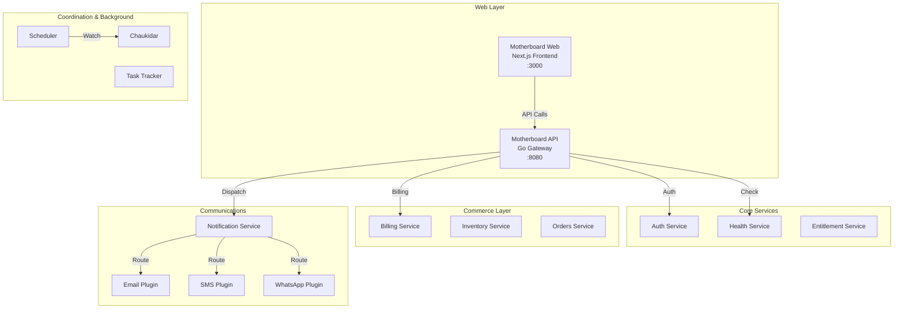

<!-- markdownlint-disable MD033 MD036 MD051 -->

# Motherboard Platform

> A comprehensive multi-service platform for workspace management, communication plugins, and business automation

<div align="center">

[](https://nextjs.org/)
[](https://go.dev/)
[](https://docker.com/)
[](LICENSE)

</div>

## 📋 Table of Contents

- [Overview](#overview)
- [Architecture](#architecture)
- [Workspace Index](#workspace-index)
- [Quick Start](#quick-start)
- [Development](#development)
- [Documentation](#documentation)
- [Contributing](#contributing)

## 🎯 Overview

Motherboard is a modular platform ecosystem consisting of core services, microservices, communication plugins, and frontend applications. The platform provides multi-tenant workspace management, authentication, billing, health monitoring, and seamless integration with external communication providers.

### Key Features

- 🏢 **Multi-tenant Architecture** - Isolated workspaces with RBAC
- 🔐 **OAuth2 Authentication** - Secure authentication within `motherboard-core`
- 💳 **Commerce Hub** - Billing, inventory, and order management
- 🔌 **Extensible Communication** - Unified Notification Service with Email, SMS, WhatsApp, and Telegram integrations
- 📊 **Health Monitoring** - Comprehensive service health tracking
- 🔄 **Event Coordination** - Automated syncing with GitHub/Jira via Scheduler and Chaukidar
- ☁️ **Cloud Agnostic** - Build and deploy anywhere with shared Docker infrastructure

## 🏗️ Architecture



## 📚 Workspace Index

The repository is organized into a modular Go workspace (`go.work`), combining frontend and backend infrastructure:

### 🎯 Web & API Layer

| Module                                   | Description                      | Port |
| ---------------------------------------- | -------------------------------- | ---- |
| [**motherboard-web**](./motherboard-web) | Next.js 14+ frontend application | 3000 |
| [**motherboard-api**](./motherboard-api) | Go-based API Gateway             | 8080 |

### ⚙️ Core & Coordination

| Module                                                     | Description                                                         | Port    |
| ---------------------------------------------------------- | ------------------------------------------------------------------- | ------- |
| [**motherboard-core**](./motherboard-core)                 | Essential microservices: `auth`, `health`, `entitlement`, `metrics` | Various |
| [**motherboard-coordination**](./motherboard-coordination) | Event orchestration: `scheduler`, `task-tracker`, `chaukidar`       | Various |

### 🏪 Commerce & Communications

| Module                                                         | Description                                                              | Port    |
| -------------------------------------------------------------- | ------------------------------------------------------------------------ | ------- |
| [**motherboard-commerce**](./motherboard-commerce)             | Business logic: `billing`, `inventory`, `orders`                         | Various |
| [**motherboard-communications**](./motherboard-communications) | Delivery plugins: `email`, `sms`, `whatsapp`, `telegram`, `notification` | Various |

### 🏗️ Shared & Infrastructure

| Module                                         | Description                                                                                 |
| ---------------------------------------------- | ------------------------------------------------------------------------------------------- |
| [**motherboard-shared**](./motherboard-shared) | Core packages, models, middleware, and database adapters shared across all Go microservices |
| [**motherboard-infra**](./motherboard-infra)   | Dockerfiles, Docker Compose files, environment configurations, and deployment scripts       |

## 🚀 Quick Start

### Prerequisites

- **Docker** & **Docker Compose** (Highly Recommended)
- **Node.js** 18+ (for manual frontend development)
- **Go** 1.21+ (for manual backend development)

### Local Docker Development (Recommended)

The easiest way to orchestrate the entire platform is via Docker Compose from the infrastructure directory:

```bash
cd motherboard-infra

# Generate necessary port registries (if not present)
make sync-ports

# Start all services (Backend, Auth, Health, Redis, MongoDB)
docker compose up -d backend auth health

# View logs
docker compose logs -f

# Shut down the ecosystem
docker compose down
```

### Manual Development Setup

If you need to run specific components locally outside Docker:

```bash
# Frontend
cd motherboard-web
npm install
npm run dev

# API Gateway
cd motherboard-api
go run main.go

# Specific Microservice (e.g., Auth)
cd motherboard-core/services/auth
go run cmd/server/main.go
```

## 💻 Development Guidelines

### Go Workspace

This repository utilizes a unified `go.work` configuration. You do not need to publish packages from `motherboard-shared/` to test them; changes are immediately reflected in dependent microservices within the workspace. Be cautious when running `go mod tidy` – ensure it's executed within the context of the respective module, or run `go work sync`.

### Environment Configuration

Ports and shared environment variables are tracked centrally within `motherboard-infra/.ports.env` and managed via registry injection. Ensure local `.env` files within modules (e.g., `motherboard-web/.env.local`) match the expected infrastructure values.

### Testing

```bash
# Frontend
cd motherboard-web
npm test

# Backend Workspace All Tests
go test ./...
```

## 📖 Documentation

Comprehensive documentation is available in the `docs/` directory:

- **[Developer Guide](./docs/DEVELOPER_GUIDE.md)** - **START HERE**: Architecture, Best Practices, and Build Process.
- **[Architecture](./docs/MOTHERBOARD_ARCHITECTURE.md)** - High-level system architecture and vision.
- **[API Reference](./docs/API_REFERENCE.md)** - API definitions and contracts.
- **[Integration Overview](./docs/INTEGRATION_OVERVIEW.md)** - How to integrate new services within the modular layout.

## 🤝 Contributing

We welcome contributions! Please see our contributing guidelines:

1. Create a feature branch (`git checkout -b feature/amazing-feature`)
2. Commit your changes (`git commit -m 'Add amazing feature'`)
3. Push to the branch (`git push origin feature/amazing-feature`)
4. Open a Pull Request

## License

This project is licensed under the MIT License.

---

**Built with ❤️ by the Motherboard Team**
