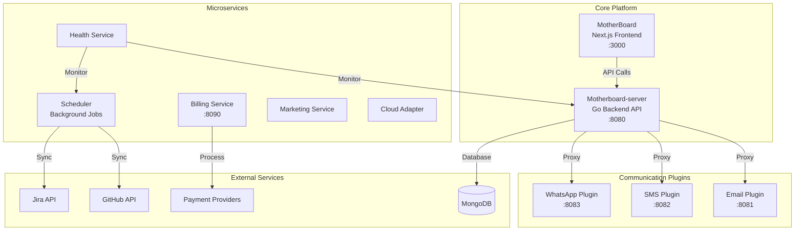

# Motherboard Platform

> A comprehensive multi-service platform for workspace management, communication plugins, and business automation

<div align="center">

[](https://nextjs.org/)
[](https://go.dev/)
[](https://python.org/)
[](LICENSE)

</div>

## 📋 Table of Contents

- [Overview](#overview)
- [Architecture](#architecture)
- [Repository Index](#repository-index)
- [Quick Start](#quick-start)
- [Development](#development)
- [Documentation](#documentation)
- [Contributing](#contributing)

## 🎯 Overview

Motherboard is a modular platform ecosystem consisting of core services, microservices, communication plugins, and development tools. The platform provides multi-tenant workspace management, authentication, billing, health monitoring, and seamless integration with external communication providers.

### Key Features

- 🏢 **Multi-tenant Architecture** - Isolated workspaces with RBAC
- 🔐 **OAuth2 Authentication** - Secure authentication with NextAuth.js
- 💳 **Multi-provider Billing** - Stripe, PayPal, and Razorpay integration
- 🔌 **Extensible Plugin System** - Email, SMS, and WhatsApp plugins
- 📊 **Health Monitoring** - Comprehensive service health tracking
- 🔄 **Background Jobs** - Automated syncing with GitHub and Jira
- ☁️ **Cloud Agnostic** - Deploy anywhere with cloud adapter

## 🏗️ Architecture



## 📚 Repository Index

### 🎯 Core Platform

| Repository | Description | Tech Stack | Port |
|------------|-------------|------------|------|
| [**MotherBoard**](./MotherBoard) | Main frontend application with Next.js 14+, React, and Tailwind CSS | Next.js, React, TypeScript | 3000 |
| [**Motherboard-server**](./Motherboard-server) | Core backend API with authentication, plugin proxy, and business logic | Go, Gin, MongoDB | 8080 |

### ⚙️ Microservices

| Repository | Description | Tech Stack | Port |
|------------|-------------|------------|------|
| [**Motherboard-scheduler**](./Motherboard-scheduler) | Background job processor for GitHub/Jira sync and webhooks | Go | - |
| [**Motherboard-billing-service**](./Motherboard-billing-service) | Payment processing with Stripe, PayPal, and Razorpay | Go, MongoDB | 8090 |
| [**Motherboard-health-service**](./Motherboard-health-service) | Health monitoring and metrics aggregation | Go | - |
| [**Motherboard-marketing-service**](./Motherboard-marketing-service) | Marketing automation and campaign management | Go | - |
| [**Motherboard-cloud-adapter**](./Motherboard-cloud-adapter) | Cloud provider abstraction layer | Go | - |
| [**Motherboard-notification-service**](./services/notification-service) | Stateful notification tracker (The Action Engine) with event-driven dispatch and channel polymorphism | Go, MongoDB | 8094 |

### 🔌 Communication Plugins

| Repository | Description | Tech Stack | Port |
|------------|-------------|------------|------|
| [**Email-Plugin**](./plugins/email) | Email delivery via Resend API | Go, Resend | 8081 |
| [**SMS-Plugin**](./plugins/sms) | Multi-provider SMS (Twilio, Exotel) | Go | 8082 |
| [**WhatsApp-Plugin**](./plugins/telephony/whatsapp) | WhatsApp messaging integration | Go | 8083 |
| [**Telegram-Plugin**](./plugins/telephony/telegram) | Telegram Bot API with inline keyboards | Go | 8084 |

### 🛠️ Development Tools

| Repository | Description | Tech Stack |
|------------|-------------|------------|
| [**Jira_tracker**](./Jira_tracker) | Jira tracking and monitoring utility | Python |

## 🚀 Quick Start

### Prerequisites

- **Docker** & **Docker Compose** (recommended)
- **Node.js** 18+ (for manual frontend development)
- **Go** 1.21+ (for manual backend development)
- **MongoDB** 7.0+ (included in Docker setup)

### Local Development (Recommended)

Use the deployment script for easy setup:

```bash
# Clone the repository
git clone <repository-url>
cd Motherboard

# Start all services with one command
./deploy.sh local up

# Or run in background
./deploy.sh local up -d

# View logs
./deploy.sh local logs

# Stop all services
./deploy.sh local down
```

Services will be available at:

- Frontend: <http://localhost:3000>
- Backend API: <http://localhost:8080>
- Billing Service: <http://localhost:8090>
- Notification Service: <http://localhost:8094>
- Email Plugin: <http://localhost:8081>
- SMS Plugin: <http://localhost:8082>
- WhatsApp Plugin: <http://localhost:8083>
- Telegram Plugin: <http://localhost:8084>

### Production Deployment

Deploy to a single instance (VPS/Cloud):

```bash
# On your production server
git clone <repository-url>
cd Motherboard

# Configure environment
cp .env.production.example .env.production
nano .env.production  # Update with your values

# Deploy
./deploy.sh production up -d

# Check status
./deploy.sh production status
```

**💰 Free Option**: Deploy on Oracle Cloud Free Tier for $0/month!
See [ULTRA_BUDGET_DEPLOYMENT.md](./docs/ULTRA_BUDGET_DEPLOYMENT.md)

### Alternative: Docker Compose (Classic)

```bash
# Start all services without the script
docker-compose up -d

# View logs
docker-compose logs -f

# Stop all services
docker-compose down
```

### Manual Setup

For individual service development, refer to each repository's README:

1. **Frontend**: See [MotherBoard/README.md](./MotherBoard/README.md)
2. **Backend**: See [Motherboard-server/README.md](./Motherboard-server/README.md)
3. **Plugins**: See individual plugin READMEs

## 💻 Development

### Environment Configuration

Each service requires its own `.env` file. See DEVELOPMENT.md for detailed environment setup.

### Running Services Individually

```bash
# Frontend
cd MotherBoard
npm install
npm run dev

# Backend
cd Motherboard-server
go mod download
go run main.go

# Scheduler
cd Motherboard-scheduler
go run main.go

# Email Plugin
cd plugins/email
go run main.go
```

### Testing

```bash
# Frontend tests
cd MotherBoard
npm test

# Backend tests
cd Motherboard-server
go test ./...

# Integration tests
docker-compose -f docker-compose.test.yml up
```

## 📖 Documentation

## 📖 Documentation

Comprehensive documentation is available in the `docs/` directory:

- **[Developer Guide](./docs/DEVELOPER_GUIDE.md)** - **START HERE**: Architecture, Best Practices, and Build Process.
- **[Architecture](./docs/MOTHERBOARD_ARCHITECTURE.md)** - High-level system architecture and vision.
- **[API Reference](./docs/API_REFERENCE.md)** - API definitions and contracts.
- **[Capabilities & Plans](./docs/CAPABILITIES_AND_PLANS.md)** - Current capabilities and future roadmap.
- **[Gap Analysis](./docs/GAP_ANALYSIS.md)** - Implementation gaps and verified features.
- **[Integration Overview](./docs/INTEGRATION_OVERVIEW.md)** - How to integrate new services.
- **[Frontend Compatibility](./docs/MOTHERBOARD_FRONTEND_COMPATIBILITY.md)** - Frontend integration details.

### Component Documentation

- [Backend Documentation](./core/motherboard-server/docs/)
- [Plugin Architecture](./docs/MOTHERBOARD_ARCHITECTURE.md#plugin-architecture)

## 🤝 Contributing

We welcome contributions! Please see our contributing guidelines:

1. Fork the relevant repository
2. Create a feature branch (`git checkout -b feature/amazing-feature`)
3. Commit your changes (`git commit -m 'Add amazing feature'`)
4. Push to the branch (`git push origin feature/amazing-feature`)
5. Open a Pull Request

### Development Guidelines

- Follow the existing code style and conventions
- Write tests for new features
- Update documentation as needed
- Ensure all tests pass before submitting PR

## 📊 Service Status

| Service | Status | Last Updated |
|---------|--------|--------------|
| MotherBoard | ✅ Active | 2026-01-18 |
| Motherboard-server | ✅ Active | 2026-01-18 |
| Motherboard-scheduler | ✅ Active | 2026-01-17 |
| Motherboard-billing-service | ✅ Active | 2026-01-16 |
| Email-Plugin | ✅ Active | 2026-01-16 |
| SMS-Plugin | ✅ Active | 2026-01-16 |
| WhatsApp-Plugin | ✅ Active | 2026-01-16 |
| Telegram-Plugin | ⚠️ In Development | 2026-01-18 |
| Health Service | ⚠️ In Development | - |
| Marketing Service | ⚠️ In Development | - |
| Cloud Adapter | ⚠️ In Development | - |
| Notification Service | ⚠️ In Development | 2026-01-18 |

## 📄 License

This project is licensed under the MIT License - see individual repositories for details.

## 🔗 Related Resources

- [GitHub Issues](https://github.com/issues)
- [Project Roadmap](#)
- [API Documentation](#)
- [Deployment Guide](./DEVELOPMENT.md#deployment)

---

**Built with ❤️ by the Motherboard Team**
