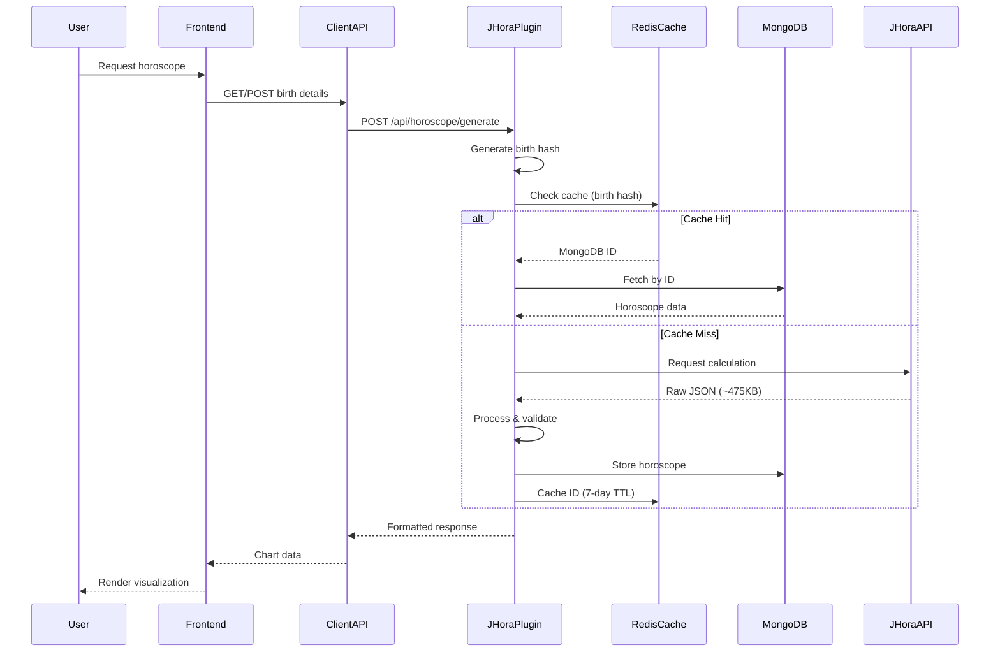

# JHora Integration Architecture

> **Comprehensive architectural design for integrating JHora astrology calculations across Vipin Kaushik and SSJK platforms**

---

## Executive Summary

This document defines the complete architecture for the **JHora Plugin** - a centralized Vedic astrology calculation service that serves multiple client applications within the Motherboard ecosystem. The plugin processes comprehensive astrological data (~475KB per horoscope) including 23 divisional charts, 4 dasha systems, yogas, doshas, and planetary strengths.

**Key Design Decisions:**

- ✅ Centralized plugin architecture for code reusability
- ✅ Client-specific data storage for privacy and flexibility
- ✅ Redis caching for performance (7-day TTL)
- ✅ RESTful API with section-based filtering
- ✅ Distinct UI strategies: Technical (Vipin) vs Professional (SSJK)

---

## 1. Data Flow Architecture

### 1.1 Complete Request Flow



### 1.2 Data Processing Pipeline

```
┌─────────────────────────────────────────────────────────────┐
│ 1. INPUT VALIDATION                                         │
│    - Birth date/time format (YYYY-MM-DD HH:MM:SS)          │
│    - Coordinates (-90 to 90, -180 to 180)                  │
│    - Timezone (-12 to +14)                                  │
└────────────────────┬────────────────────────────────────────┘
                     │
┌────────────────────▼────────────────────────────────────────┐
│ 2. HASH GENERATION                                          │
│    SHA-256(date + time + lat + lng + tz)                   │
│    → birthHash: "abc123def456..."                          │
└────────────────────┬────────────────────────────────────────┘
                     │
┌────────────────────▼────────────────────────────────────────┐
│ 3. CACHE LOOKUP (Redis)                                     │
│    Key: "jhora:birth:{birthHash}"                          │
│    Value: MongoDB ObjectId                                  │
│    TTL: 604800 seconds (7 days)                            │
└────────────────────┬────────────────────────────────────────┘
                     │
         ┌───────────┴───────────┐
         │                       │
    Cache Hit              Cache Miss
         │                       │
         ▼                       ▼
┌─────────────────┐    ┌──────────────────────┐
│ 4a. FETCH FROM  │    │ 4b. CALL JHORA API   │
│     MONGODB     │    │     (External)       │
│                 │    │  - Send birth details│
│ - Query by ID   │    │  - Receive JSON      │
│ - Return data   │    │  - ~9565 lines       │
└────────┬────────┘    └──────────┬───────────┘
         │                        │
         │             ┌──────────▼───────────┐
         │             │ 5. PROCESS RAW JSON  │
         │             │  - Parse JSON        │
         │             │  - Validate schema   │
         │             │  - Extract sections  │
         │             └──────────┬───────────┘
         │                        │
         │             ┌──────────▼───────────┐
         │             │ 6. STORE IN MONGODB  │
         │             │  - Save horoscope    │
         │             │  - Generate ID       │
         │             └──────────┬───────────┘
         │                        │
         │             ┌──────────▼───────────┐
         │             │ 7. UPDATE CACHE      │
         │             │  - Store ID in Redis │
         │             │  - Set 7-day TTL     │
         │             └──────────┬───────────┘
         │                        │
         └────────────┬───────────┘
                      │
         ┌────────────▼────────────┐
         │ 8. FORMAT RESPONSE      │
         │  - Filter by sections   │
         │  - Apply transformations│
         │  - Add metadata         │
         └────────────┬────────────┘
                      │
         ┌────────────▼────────────┐
         │ 9. RETURN TO CLIENT     │
         │  - JSON response        │
         │  - HTTP 200 OK          │
         └─────────────────────────┘
```

---

## 2. API Layer Design

### 2.1 JHora Plugin API (Core Service)

**Base URL**: `http://localhost:3130/api`

#### Endpoint Specifications

| Method | Endpoint | Purpose | Cache Strategy |
|--------|----------|---------|----------------|
| POST | `/horoscope/generate` | Generate/retrieve horoscope | Check cache first |
| GET | `/horoscope/:hash` | Get complete horoscope | Direct MongoDB query |
| GET | `/horoscope/:hash/charts/:division` | Get specific chart | Lazy load from MongoDB |
| GET | `/horoscope/:hash/dashas/:system` | Get dasha system | Lazy load from MongoDB |
| GET | `/horoscope/:hash/dashas/current` | Get current dasha period | Calculate on-the-fly |
| GET | `/horoscope/:hash/yogas` | Get yoga analysis | Direct MongoDB query |
| GET | `/horoscope/:hash/doshas` | Get dosha analysis | Direct MongoDB query |
| GET | `/horoscope/:hash/strengths` | Get planetary strengths | Direct MongoDB query |
| GET | `/health` | Health check | No cache |

#### Section-Based Filtering

Clients can request specific sections to reduce payload size:

```json
{
  "sections": ["basic", "charts", "dashas"]
}
```

**Available Sections:**

- `basic`: calendar_info, bhava_chart, planetary_states
- `charts`: All divisional charts (D-1 to D-144)
- `dashas`: All dasha systems
- `yogas`: Yoga analysis
- `doshas`: Dosha analysis
- `strengths`: All bala calculations
- `special`: Sahams, Upagrahas, Lagnas, Arudhas
- `full`: Complete response (default)

### 2.2 Client API Layers

#### Vipin API (Next.js App Router)

```typescript
// app/api/jhora/chart/route.ts
export async function POST(request: NextRequest) {
  const { birthDetails } = await request.json();
  
  const jhoraClient = new JHoraPluginClient({
    baseUrl: process.env.JHORA_PLUGIN_URL,
    clientId: 'vipin'
  });
  
  const horoscope = await jhoraClient.generateHoroscope({
    birthDetails,
    sections: ['basic', 'charts', 'dashas']
  });
  
  return NextResponse.json(horoscope);
}
```

#### SSJK API (Express)

```javascript
// api/astrology/charts.js
router.post('/clients/:clientId/charts', async (req, res) => {
  const { birthDetails, options } = req.body;
  
  const chart = await jhoraClient.processChart({
    userId: req.params.clientId,
    birthDetails,
    options: {
      divisionalCharts: ['D1', 'D9', 'D10', 'D16', 'D20', 'D24', 'D30', 'D60']
    }
  });
  
  res.json(chart);
});
```

---

## 3. Dashboard Placement Strategy

### 3.1 Vipin Dashboard (Technical/Embedded)

**Location**: `VipinKaushik/app/dashboard/`

**Strategy**: Keep existing technical dashboard, enhance with new routes

```
VipinKaushik/app/
├── dashboard/
│   └── page.tsx                    # ✅ Existing: Overview dashboard
├── chart/
│   ├── page.tsx                    # 🆕 New: Full chart analysis
│   └── [chartId]/
│       ├── page.tsx                # 🆕 New: Specific chart view
│       ├── divisional/page.tsx     # 🆕 New: Divisional charts
│       └── dashas/page.tsx         # 🆕 New: Dasha timeline
```

**UI Characteristics:**

- **Design Language**: "Cosmic Blueprint"
- **Color Scheme**: Dark (#0a0a0f), Cyan accent (#00d9ff)
- **Typography**: Monospace (JetBrains Mono)
- **Charts**: SVG-based, minimal line-art
- **Layout**: Single-page, grid-based
- **Target**: Tech-savvy users, embedded chatbot

### 3.2 SSJK Dashboard (Professional/Mature)

**Location**: `SSJK/pages/clients/[clientId]/`

**Strategy**: Build comprehensive multi-page dashboard

```
SSJK/pages/clients/[clientId]/
├── dashboard.tsx                   # Client overview
├── charts/
│   ├── index.tsx                   # Chart list
│   └── [chartId]/
│       ├── overview.tsx            # Chart overview with D1
│       ├── divisional.tsx          # All divisional charts (D1-D60)
│       ├── dashas.tsx              # Dasha analysis + timeline
│       ├── strengths.tsx           # Shad Bala, Bhava Bala, etc.
│       ├── yogas.tsx               # Yoga combinations
│       └── doshas.tsx              # Dosha analysis + remedies
├── consultations/
│   ├── index.tsx                   # Consultation history
│   └── [consultationId]/page.tsx  # Consultation details
└── reports/
    └── index.tsx                   # PDF report generation
```

**UI Characteristics:**

- **Design Language**: "Vedic Elegance"
- **Color Scheme**: Cream (#faf8f3), Gold (#d4af37), Maroon (#800020)
- **Typography**: Serif (Playfair Display), Sans (Inter)
- **Charts**: Rich D3.js visualizations, interactive
- **Layout**: Multi-page, tabbed interface, sidebar navigation
- **Target**: Professional astrologers + clients

### 3.3 UI Separation Matrix

| Aspect | Vipin (Embedded) | SSJK (Mature) |
|--------|------------------|---------------|
| **Color Scheme** | Dark, technical (blueprint) | Light, professional (cream/gold) |
| **Typography** | Monospace, data-focused | Serif, elegant |
| **Visualizations** | Minimal, SVG-based | Rich, interactive (D3.js) |
| **Layout** | Single-page dashboard | Multi-page, tabbed interface |
| **Interactivity** | Static display | Interactive exploration (zoom, filters) |
| **Navigation** | Embedded in chatbot | Dedicated sidebar navigation |
| **Data Density** | High (compact) | Medium (spacious) |
| **Target Audience** | Tech-savvy users | Professional astrologers + clients |
| **Use Case** | Quick reference | In-depth consultation |

---

## 4. Data Storage Schema

### 4.1 MongoDB Schema

#### Collection: `horoscopes`

```javascript
{
  _id: ObjectId("..."),
  birthHash: "abc123def456...",  // SHA-256 hash (unique index)
  clientId: "vipin" | "ssjk",
  userId: "user_123",
  
  // Input
  birthDetails: {
    date: "1992-09-05",
    time: "00:09:00",
    place: "Bhopal",
    latitude: 23.25469,
    longitude: 77.40289,
    timezone: 5.5
  },
  
  // Complete JHora API response (stored as-is)
  horoscopeData: {
    calendar_info: { ... },        // 25+ panchang fields
    bhava_chart: [ ... ],          // 12 houses
    divisional_charts: {
      "D-1_rasi": { ... },         // 23 charts × 10 planets
      "D-9_navamsa": { ... },
      // ... D-144
    },
    nakshatra_pada: { ... },       // 10 planets
    amsa_rulers: { ... },          // 35+ points
    yogas: {
      summary: { ... },
      yoga_list: { ... }           // 15+ yogas
    },
    doshas: { ... },               // 8 doshas (HTML)
    chara_karakas: { ... },        // 8 karakas
    sahams: { ... },               // 34 sahams
    upagrahas: { ... },            // 11 upagrahas
    special_lagnas: { ... },       // 9 lagnas
    arudha_padhas: { ... },        // 276 arudhas
    planetary_states: { ... },     // 7 states
    shad_bala: [ ... ],            // 9×7 matrix
    bhava_bala: [ ... ],           // 12 houses
    other_bala: { ... },           // 5 types
    vimsopaka_bala: [ ... ],       // 4 schemes
    ashtakavarga: { ... },         // BAV, SAV, Prastara
    graha_dashas: {
      vimsottari: [ ... ],         // 100+ periods
      ashtottari: [ ... ],
      yogini: [ ... ],
      shodasottari: [ ... ]
    },
    sade_sati: { ... },            // Transit analysis
    ayanamsa_value: 24.221298,
    julian_day: 2461067.5
  },
  
  // Metadata
  createdAt: ISODate("2026-02-05T10:30:00Z"),
  updatedAt: ISODate("2026-02-05T10:30:00Z"),
  sourceApi: "jhora",
  apiVersion: "1.0.0"
}
```

**Indexes:**

- `birthHash`: Unique index for fast lookups
- `clientId + userId`: Compound index for user queries
- `createdAt`: For time-based queries

**Size**: ~475KB per document

### 4.2 Redis Cache Schema

```
Key Pattern: "jhora:birth:{birthHash}"
Value: MongoDB ObjectId (string)
TTL: 604800 seconds (7 days)

Example:
Key: "jhora:birth:abc123def456..."
Value: "507f1f77bcf86cd799439011"
TTL: 604800
```

**Cache Strategy:**

1. Generate hash from birth details
2. Check Redis for cached MongoDB ID
3. If hit: Fetch from MongoDB by ID
4. If miss: Call JHora API → Store in MongoDB → Cache ID

---

## 5. Client-Specific Implementation

### 5.1 Vipin Integration

#### Motherboard Client

```javascript
// VipinKaushik-mb/server/clients/jhora-client.js
class JhoraClient {
  constructor(config) {
    this.baseUrl = config.jhoraPluginUrl;
    this.clientId = 'vipin';
  }

  async processChart(birthDetails, options = {}) {
    const response = await axios.post(`${this.baseUrl}/api/horoscope/generate`, {
      clientId: this.clientId,
      birthDetails,
      sections: options.sections || ['basic', 'charts', 'dashas']
    });
    return response.data;
  }

  async getChart(birthHash) {
    const response = await axios.get(`${this.baseUrl}/api/horoscope/${birthHash}`, {
      headers: { 'X-Client-ID': this.clientId }
    });
    return response.data;
  }
}
```

### 5.2 SSJK Integration

#### Motherboard Client

```javascript
// SSJK-mb/server/clients/jhora-client.js
class JhoraClient {
  constructor(config) {
    this.baseUrl = config.jhoraPluginUrl;
    this.clientId = 'ssjk';
  }

  async processChart(data) {
    const response = await axios.post(`${this.baseUrl}/api/horoscope/generate`, {
      clientId: this.clientId,
      ...data,
      sections: ['full']  // SSJK needs complete data
    });
    return response.data;
  }

  async getUserCharts(userId) {
    const response = await axios.get(`${this.baseUrl}/api/users/${userId}/charts`, {
      headers: { 'X-Client-ID': this.clientId }
    });
    return response.data;
  }

  async batchProcess(charts) {
    const response = await axios.post(`${this.baseUrl}/api/horoscope/batch`, {
      clientId: this.clientId,
      charts
    });
    return response.data;
  }
}
```

---

## 6. Comprehensive Data Reference

### 6.1 JHora API Response Structure

**Total Size**: ~475KB JSON (9,565 lines)

**Major Sections** (20+):

1. **birth_details** (6 fields)
2. **calendar_info** (25+ panchang fields)
3. **bhava_chart** (12 houses)
4. **divisional_charts** (23 charts: D-1 to D-144)
5. **nakshatra_pada** (10 planets)
6. **amsa_rulers** (35+ points)
7. **yogas** (15 found / 93 possible)
8. **doshas** (8 types with HTML descriptions)
9. **chara_karakas** (8 karakas)
10. **sahams** (34 Arabic parts)
11. **upagrahas** (11 sub-planets)
12. **special_lagnas** (9 special ascendants)
13. **house_varnadas** (12 houses)
14. **graha_arudhas** (Planetary arudhas)
15. **surya_arudhas** (Sun-based arudhas)
16. **chandra_arudhas** (Moon-based arudhas)
17. **house_relationships** (Argala, Virodhargala)
18. **planetary_states** (7 states)
19. **shad_bala** (6-fold strength, 9×7 matrix)
20. **bhava_bala** (House strength, 12 houses)
21. **other_bala** (5 additional strength types)
22. **vimsopaka_bala** (4 schemes)
23. **vaiseshikamsa_bala** (Divisional strength)
24. **ashtakavarga** (BAV, SAV, Prastara, Pindas)
25. **arudha_padhas** (276 arudhas across all charts)
26. **sphuta** (Special calculations)
27. **graha_dashas** (4 systems with 100+ periods each)
28. **sade_sati** (Saturn transit analysis)
29. **ayanamsa_value** (Precession value)
30. **julian_day** (Astronomical day number)

**Full documentation**: See [`docs/data_schema.md`](../docs/data_schema.md)

---

## 7. Performance & Security

### 7.1 Performance Optimization

**Caching Strategy:**

- L1 Cache (Redis): Birth hash → MongoDB ID (7-day TTL)
- L2 Cache (MongoDB): Complete horoscope data (permanent)
- Response time: < 100ms for cached requests

**Lazy Loading:**

- Only process requested sections
- Divisional charts loaded on-demand
- Dasha calculations cached separately

**Connection Pooling:**

- MongoDB: 10 connections
- Redis: 5 connections

### 7.2 Security Measures

- **Input Validation**: Joi schema validation
- **Rate Limiting**: 100 requests / 15 minutes per IP
- **Data Privacy**: Client-specific data isolation
- **Error Handling**: Sentry integration
- **CORS**: Restricted to known origins

---

## 8. Deployment Configuration

### 8.1 Docker Compose

```yaml
jhora-plugin:
  build:
    context: ./plugins/verticals/astrology/jhora
    dockerfile: Dockerfile
  container_name: jhora-plugin
  ports:
    - "3130:3130"
  environment:
    - NODE_ENV=production
    - PORT=3130
    - MONGODB_URI=mongodb://mongodb:27017/motherboard
    - REDIS_URL=redis://redis:6379
    - JHORA_API_URL=${JHORA_API_URL}
    - CACHE_TTL=604800
    - SENTRY_DSN=${SENTRY_DSN}
  depends_on:
    - mongodb
    - redis
  networks:
    - motherboard-network
  healthcheck:
    test: ["CMD", "curl", "-f", "http://localhost:3130/health"]
    interval: 30s
    timeout: 10s
    retries: 3
```

---

## 9. Implementation Roadmap

### Phase 1: Plugin Development ✅

- [x] Data schema documentation
- [x] Implementation plan
- [x] API design
- [x] README creation

### Phase 2: Core Implementation (In Progress)

- [ ] Express server setup
- [ ] MongoDB models
- [ ] Processor services (port from Vipin TypeScript)
- [ ] Redis caching layer
- [ ] API endpoints
- [ ] Unit tests

### Phase 3: Vipin Integration

- [ ] JHora plugin client
- [ ] Update API routes
- [ ] Enhance dashboard
- [ ] Integration tests

### Phase 4: SSJK Integration

- [ ] Professional UI components
- [ ] Client management system
- [ ] Comprehensive dashboard
- [ ] Consultation workflow

### Phase 5: Advanced Features

- [ ] Multi-ayanamsa support
- [ ] Time rectification
- [ ] PDF export
- [ ] Chart visualization

---

## Conclusion

This architecture provides a **scalable, maintainable, and reusable** foundation for integrating JHora calculations across multiple frontends. By centralizing domain logic in a plugin and allowing client-specific UI/UX, we achieve:

✅ **Separation of Concerns**: Frontend focuses on presentation, plugin handles calculations  
✅ **Consistency**: Identical astrological algorithms across all clients  
✅ **Flexibility**: Each project customizes its dashboard and user experience  
✅ **Scalability**: Plugin scales independently and supports future clients  
✅ **Maintainability**: Single codebase for JHora processing logic  

**Next Step**: Implement the JHora plugin and begin Vipin integration.
